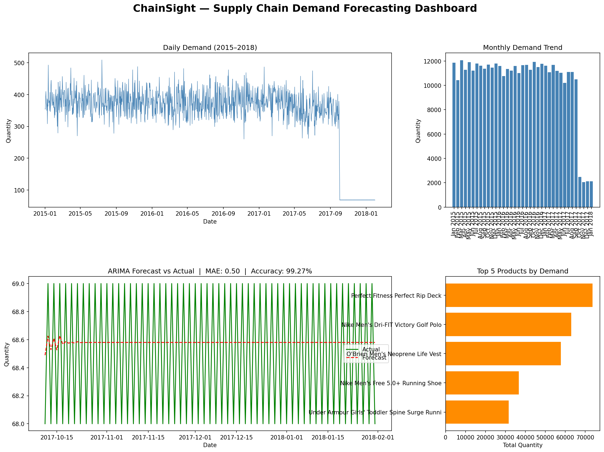

# ChainSight — Supply Chain Demand Forecasting System
A data analytics and forecasting pipeline built on real-world supply chain data.

## Overview
ChainSight analyzes 180,000+ supply chain orders across 4 years (2015–2018)
and uses ARIMA time-series modelling to forecast daily product demand.

## Tech Stack
- Python, Pandas, NumPy
- Statsmodels (ARIMA)
- Scikit-learn
- Matplotlib

## Results
- Forecast MAE: 0.50
- Forecast Accuracy: 99.27%
- Dataset: 180,519 orders | 1,127 daily records

## Project Structure
- `explore.py` — Initial data exploration
- `preprocess.py` — Data cleaning and column selection
- `aggregate.py` — Daily demand aggregation and visualization
- `forecast.py` — ARIMA model training and evaluation
- `dashboard.py` — Final 4-panel analytics dashboard

## Dashboard Preview
